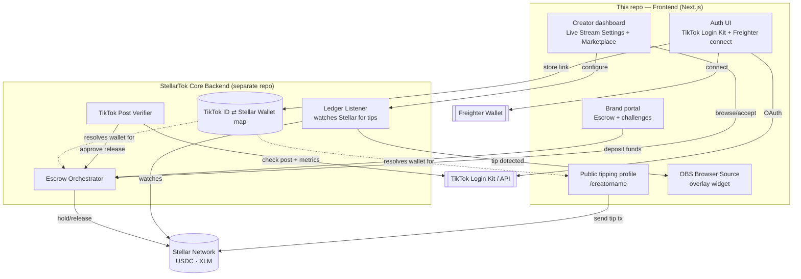
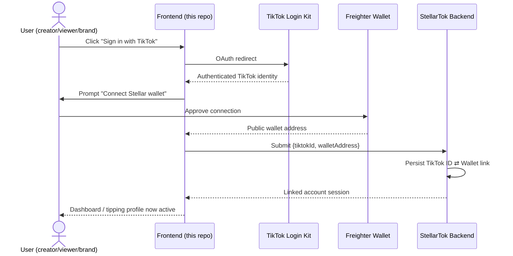
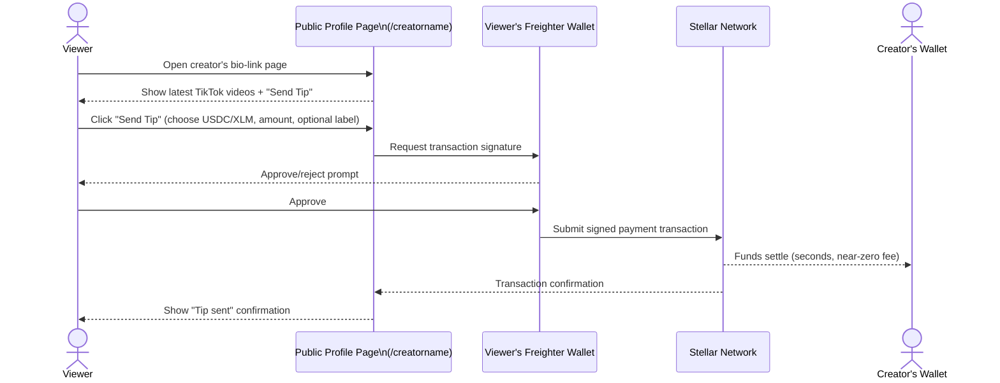
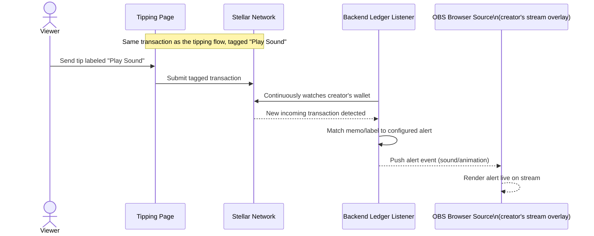
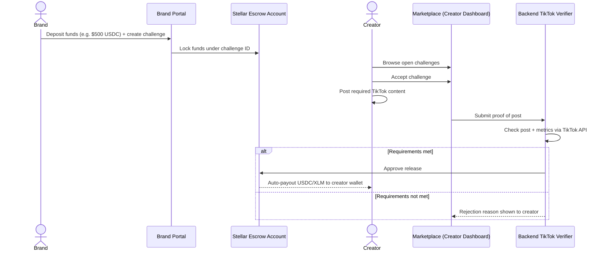

<div align="center">

# StellarTok — Frontend

**The payments layer for TikTok creators — tips, live-stream alerts, and brand payouts, settled instantly on Stellar.**

[](https://nextjs.org/)
[](https://stellar.org/)
[](https://www.freighter.app/)
[]()
[]()
[]()

[About](#about) •
[Architecture & Flows](#architecture--flows) •
[Features](#features) •
[Built With](#built-with) •
[Getting Started](#getting-started) •
[Usage](#usage) •
[Roadmap](#roadmap) •
[Contributing](#contributing) •
[License](#license)

</div>

---

## About

StellarTok links a creator's TikTok identity to their Stellar wallet, and that single connection unlocks three products at once: instant micro-tipping, real-time live-stream alerts, and trustless brand sponsorship payouts — all settled on the Stellar network in seconds for a fraction of a cent.

This repository is the Next.js web application that creators, viewers, and brands actually use: it's where a creator signs in with TikTok Login Kit and connects their Freighter wallet, where a viewer lands to tip a favorite creator, where a streamer configures OBS alerts for incoming tips, and where a brand sets up an escrow-backed campaign. It's the full client experience for the StellarTok platform — the backend (identity linking, ledger monitoring, escrow orchestration) lives in a separate service this app talks to.

> **Status:** every screen in the pitch is built and wired end-to-end — real TikTok OAuth, real Freighter transaction signing, real form validation, route protection, tests, and CI. What's _not_ real yet is the backend: there's no live identity-linking service, ledger listener, or escrow orchestrator, so those calls fail over to the fixtures in `src/lib/mock-data.ts`. This is a complete frontend for a product whose backend doesn't exist yet, not an unfinished frontend.

### The problem

TikTok has no native way for a creator to get paid directly by their audience, no way to turn a tip into a live, on-stream moment, and no trustless way for a brand to reward a creator for a sponsored post without a manual invoice-and-wire cycle. Existing tipping tools bolt on high fees, days-long payout delays, and platforms that take a large cut. StellarTok replaces all of that with a wallet-native flow: value moves on the Stellar ledger directly between viewer/brand and creator, settling in seconds for near-zero fees, with the platform taking only a negligible cut (e.g. 0.5–1%) to keep the lights on.

### Why one identity link unlocks three products

Because a creator only has to prove who they are once — TikTok Login Kit for social identity, Freighter for financial identity — every surface in this app (tipping profile, live overlay, brand marketplace) reads off that same link. There's no separate onboarding per feature, no re-verifying a wallet for each product, and no reason for a creator not to eventually use all three: a creator who joins purely for brand deals still ends up with a working tipping page and stream overlay for free, which is what makes the platform sticky rather than single-purpose.

- **Network effects** — a creator might sign up only for brand deals, but since their wallet is already linked, their tipping profile and stream overlay come for free and tend to get adopted naturally.
- **One identity, three surfaces** — viewers, creators, and brands all interact with the same underlying TikTok↔Stellar identity link, so the backend only has to solve identity verification and payment plumbing once.
- **Sustainable monetization** — a small platform fee funds hosting at a fraction of what centralized platforms typically take, while staying negligible to end users.

### At a glance

|                           |                                                                                                     |
| ------------------------- | --------------------------------------------------------------------------------------------------- |
| **Who it's for**          | Creators, their viewers, and brands running TikTok engagement campaigns                             |
| **What it replaces**      | Manual PayPal/Venmo tip jars, third-party alert tools, and invoice-based brand sponsorship payouts  |
| **What settles payments** | The Stellar network — USDC and XLM, confirmed in seconds                                            |
| **What this repo owns**   | All user-facing UI: auth, tipping profile, creator dashboard, brand portal, overlay config          |
| **What it doesn't own**   | Custody, escrow logic, ledger monitoring, and TikTok post verification — all handled by the backend |

## Architecture & Flows

This section diagrams how the frontend fits into the wider StellarTok system, and walks through each of the four flows a user can trigger: connecting identity, tipping, live-stream alerts, and brand escrow payouts.

### 1. System architecture



**How to read this:** the frontend (this repo, left box) never talks to the Stellar network or TikTok API directly for anything security-sensitive — it either calls the backend, or uses Freighter to sign a transaction the user initiates themselves. The backend owns the identity map, watches the ledger, orchestrates escrow, and verifies TikTok posts. The frontend's job is entirely about rendering the right UI for whichever identity is signed in and reacting to what the backend reports back.

### 2. Identity linking (the flow everything else depends on)



**Why this matters:** every other diagram below assumes this handshake already happened. Once the backend has stored the `tiktokId ⇄ walletAddress` pair, the frontend can render a tipping profile, unlock the dashboard, and let the user accept brand challenges — without asking them to re-prove identity or reconnect a wallet on each page.

### 3. Micro-tipping flow (Feature 1)



**Detail:** the frontend only ever builds an unsigned transaction and hands it to Freighter — it never touches the viewer's private key. The label field (e.g. "Play Sound") attached to the transaction memo is what Feature 2's listener keys off of later.

### 4. Live-stream overlay alert flow (Feature 2)



**Detail:** the creator's dashboard (this repo) is only responsible for generating the OBS Browser Source URL and letting the creator map labels (like "Play Sound") to specific sounds/animations. The actual ledger-watching and event-pushing is backend logic; the overlay itself is a lightweight page this frontend serves that just listens for backend-pushed events and plays the matching effect.

### 5. Brand campaign escrow flow (Feature 3)



**Detail:** the brand portal and marketplace UI (both in this repo) never move funds themselves — they only trigger backend actions. The escrow release is fully automatic once the verifier approves, which is what lets StellarTok promise "no manual payout, no chasing brands for payment" from the pitch.

## Features

- 🔐 **Auth** — real TikTok Login Kit OAuth (CSRF-protected via a state cookie) plus Freighter wallet connect. `AuthContext` derives a linked identity client-side the moment both are present, and best-effort syncs it to the backend.
- 🛡️ **Route protection** — middleware redirects unauthenticated requests away from `/dashboard`; the brand portal is gated behind a connected wallet.
- 💸 **Public tipping profile** — `stellartok.app/creatorname` page rendering a creator's latest TikTok videos with a "Send Tip" action per video, with instant client-side amount validation and Horizon errors (e.g. missing trustlines) translated into plain language.
- 🎮 **Creator dashboard**
  - _Live Stream Settings_ — OBS Browser Source URL, alert-rule config, a working live overlay page with a `?simulate=1` preview mode.
  - _Campaign Marketplace (creator side)_ — browse open challenges, accept one, and submit a TikTok post URL for verification.
- 💼 **Brand portal** — campaign creation that actually builds, signs (via Freighter), and submits a Stellar payment into a backend-allocated escrow address — it refuses to build a transaction if the backend can't allocate one, rather than sending funds to a guessed address.
- 🔎 **Share-ready SEO** — generated favicon, per-creator Open Graph/Twitter cards (dynamic image per creator), `robots.txt`, `sitemap.xml`.
- 🧩 **Chrome Extension surface** _(not built)_ — would inject a tipping button on TikTok.com so desktop viewers can tip without leaving the platform.

## Built With

- [Next.js 15](https://nextjs.org/) (App Router) + TypeScript + Tailwind CSS
- [Freighter API](https://www.freighter.app/) for Stellar wallet connection and transaction signing (client-side only)
- [Stellar SDK](https://developers.stellar.org/) for building/submitting payment transactions — **server-only**, used from API routes so its native crypto deps never reach the browser bundle
- [Zod](https://zod.dev/) for fail-fast server-side environment validation (`src/lib/env.server.ts`, run once at boot via `instrumentation.ts`)
- TikTok Login Kit / TikTok API for authentication and post/metric verification
- [Vitest](https://vitest.dev/) + [React Testing Library](https://testing-library.com/react) for unit and component tests
- Husky + lint-staged + `prettier-plugin-tailwindcss` for pre-commit formatting/linting
- A backend-defined REST API (StellarTok Core Backend, separate repo — not built yet) for identity linking, ledger monitoring, and escrow orchestration

## Getting Started

### Prerequisites

- Node.js (LTS) and npm

Everything else is optional for local UI work — the app runs fully on fixtures without them:

- A [Freighter](https://www.freighter.app/) wallet browser extension, to actually connect a wallet and sign transactions
- TikTok Login Kit developer credentials, to complete real OAuth instead of seeing the sign-in button do nothing
- A running instance of the StellarTok backend, for anything to actually persist

### Installation

```bash
git clone <this-repo-url>
cd Frontend
npm install
npm run dev
```

The app will be available at `http://localhost:3000` once the dev server starts. Without a live StellarTok backend or `.env.local` configured, every route still renders using the fixtures in `src/lib/mock-data.ts` — useful for UI work before the backend exists. Environment variables are validated at server startup (`src/instrumentation.ts`) — a missing or malformed value fails immediately with a readable error instead of misbehaving later.

Other scripts:

```bash
npm run build      # production build
npm run start      # run the production build
npm run lint       # ESLint (next/core-web-vitals)
npm run typecheck  # tsc --noEmit
npm test           # Vitest — unit + component tests
npm run format     # Prettier --write (includes Tailwind class sorting)
```

A pre-commit hook (Husky + lint-staged) runs ESLint and Prettier on staged files automatically.

### Environment Variables

Copy `.env.example` to `.env.local` and fill in what you have — every field has a sensible local default except the two marked below:

```bash
cp .env.example .env.local
```

```
# StellarTok backend API this frontend talks to
NEXT_PUBLIC_STELLARTOK_API_URL=http://localhost:4000

# Canonical URL this app is deployed at — used for metadataBase, Open Graph
# share previews, and the sitemap.
NEXT_PUBLIC_APP_URL=http://localhost:3000

# TikTok Login Kit / API credentials
NEXT_PUBLIC_TIKTOK_CLIENT_KEY=
TIKTOK_CLIENT_SECRET=
NEXT_PUBLIC_TIKTOK_REDIRECT_URI=http://localhost:3000/auth/callback/tiktok

# Stellar network to target (testnet while in development)
NEXT_PUBLIC_STELLAR_NETWORK=testnet
NEXT_PUBLIC_STELLAR_HORIZON_URL=https://horizon-testnet.stellar.org

# USDC issuer account for each network — NO safe default. Verify against
# https://stellar.expert or Circle's published issuer list before setting
# this; a wrong value silently misroutes USDC payments.
STELLAR_USDC_ISSUER_MAINNET=
STELLAR_USDC_ISSUER_TESTNET=

# Platform fee taken on tips/campaign payouts, as a decimal (0.01 = 1%)
NEXT_PUBLIC_PLATFORM_FEE=0.01
```

Never commit real client secrets — keep `.env.local` out of version control (it's already covered by the default Next.js `.gitignore`).

## Usage

Once running, the app exposes three entry points depending on who's using it:

- **Creators/viewers** — visit `/creatorname` for a public tipping profile, or sign in to reach the creator dashboard for live-stream and campaign settings.
- **Streamers** — copy the OBS Browser Source URL from the dashboard's _Live Stream Settings_ tab into OBS to bring tip alerts on-screen.
- **Brands** — sign in through the brand portal to fund an escrow and launch a challenge for creators to accept.

### Project structure

```
Frontend/
├── src/
│   ├── instrumentation.ts              # Validates env vars once at server boot (fail fast)
│   ├── middleware.ts                   # Redirects unauthenticated requests away from /dashboard
│   ├── app/
│   │   ├── page.tsx                    # Landing page
│   │   ├── layout.tsx                  # Root layout — metadataBase, OG/Twitter defaults
│   │   ├── icon.tsx / apple-icon.tsx   # Generated favicon
│   │   ├── robots.ts / sitemap.ts      # SEO metadata routes
│   │   ├── loading.tsx / error.tsx / not-found.tsx
│   │   ├── [creatorname]/              # Public tipping profile (Feature 1)
│   │   │   └── opengraph-image.tsx     # Per-creator dynamic share-card image
│   │   ├── dashboard/                  # Creator dashboard (gated by DashboardGate + middleware)
│   │   │   ├── live-stream/            # OBS overlay URL + alert rules (Feature 2)
│   │   │   └── marketplace/            # Browse/accept brand challenges (Feature 3)
│   │   ├── brand/                      # Brand portal + campaign creation (gated by BrandGate)
│   │   ├── overlay/[token]/            # Transparent OBS Browser Source page
│   │   ├── auth/callback/tiktok/       # Server-side TikTok OAuth exchange + session cookie
│   │   └── api/
│   │       ├── auth/tiktok/start/      # Starts OAuth, sets CSRF state cookie
│   │       ├── session/                # Read/clear the TikTok session cookie
│   │       ├── tip/                    # Server-only tip tx build (validated, rate-limited)
│   │       ├── escrow/fund/            # Server-only escrow funding tx build
│   │       └── stellar/submit/         # Server-only signed-tx submission (shared by tip + escrow)
│   ├── components/                     # Navbar, TipButton, ChallengeCard, gates, ui/ primitives
│   │   └── *.test.tsx                  # React Testing Library component tests
│   ├── context/AuthContext.tsx         # Derives identity from TikTok session + connected wallet
│   ├── hooks/useOverlayEvents.ts       # Live-alert subscription for the overlay page
│   ├── lib/
│   │   ├── env.ts / env.server.ts      # Client-safe config vs. Zod-validated server secrets
│   │   ├── stellar.ts                  # Server-only Stellar SDK usage
│   │   ├── stellar-network.ts          # Client-safe network passphrase (no SDK import)
│   │   ├── stellar-client.ts           # Client fetch wrappers for the tx-building API routes
│   │   ├── payment-validation.ts       # Isomorphic amount validation (client + server)
│   │   ├── request-json.ts             # Safe JSON body parsing for route handlers
│   │   ├── rate-limit.ts               # In-memory per-IP rate limiter
│   │   ├── session.ts                  # TikTok session cookie encode/decode
│   │   ├── tiktok.ts / api.ts / mock-data.ts
│   │   └── *.test.ts                   # Vitest unit tests
│   └── types/                          # Shared TypeScript types
├── .github/workflows/ci.yml            # lint, typecheck, test, build on every push/PR
├── .husky/pre-commit                   # lint-staged on staged files
└── public/                             # Static assets
```

`src/lib/stellar.ts` imports the Stellar SDK and is server-only (used from the API routes above); client code that only needs the network passphrase imports the lightweight `src/lib/stellar-network.ts` instead, keeping the SDK's native crypto dependencies out of the browser bundle. `src/lib/env.ts` follows the same split for the same reason — it stayed dependency-free after an early version that imported Zod added ~18KB to every client route's bundle.

**Known simplifications, called out rather than hidden:**

- The session cookie (`src/lib/session.ts`) is unsigned base64, not a signed/encrypted session — fine for local dev, not for production.
- Brand identity is just "a connected wallet" (`BrandGate`) — there's no real brand account system yet.
- The in-memory rate limiter (`src/lib/rate-limit.ts`) doesn't share state across instances; a multi-instance deploy needs a shared store.
- The best-effort backend sync in `AuthContext` (`linkIdentity`) fails silently when there's no backend — the identity link still works locally (TikTok session + wallet are enough to unlock the UI), it just isn't persisted remotely yet.
- USDC issuer addresses are intentionally unset by default (`STELLAR_USDC_ISSUER_*`) — verify independently before setting them.

### Repo scope

This repository is the **frontend only**. Identity linking, tip detection on the Stellar ledger, escrow contract management, and TikTok API verification live in the StellarTok backend service — this app renders UI and calls that service, but holds no custodial logic itself.

## Roadmap

**Done in this repo:**

- [x] TikTok Login Kit OAuth + Freighter connect flow (CSRF-protected, session cookie)
- [x] Route protection (middleware for `/dashboard`, wallet gate for `/brand`)
- [x] Public creator tipping profile page with client-validated tipping
- [x] Creator dashboard shell with Live Stream Settings tab + working overlay page
- [x] OBS overlay alert widget (with a `?simulate=1` local preview mode)
- [x] Brand portal: escrow-funding flow (build → sign → submit via Freighter)
- [x] Creator-side campaign marketplace browsing, accepting, and proof submission
- [x] SEO/share metadata, empty states, accessibility pass, test suite, CI

**Blocked on the backend (not something this repo can finish alone):**

- [ ] Real identity-linking persistence (currently client-side only, best-effort synced)
- [ ] Ledger listener that actually fires overlay alerts from real tips
- [ ] Escrow account allocation and automatic release on verified posts
- [ ] TikTok post/metrics verification

**Not started:**

- [ ] Chrome Extension for in-page TikTok.com tipping
- [ ] Signed/encrypted session (currently unsigned, dev-only)
- [ ] Shared (non-in-memory) rate limiting for multi-instance deploys

See the [open issues](../../issues) for the full list of proposed features and known issues.

## Contributing

This project is under active early development. If you're picking up work here, check the current issues/board for what's in progress before starting a new feature to avoid overlap. See [CONTRIBUTING.md](./CONTRIBUTING.md) for setup, scripts, and the conventions this codebase follows (the mock-data-fallback pattern, server-only modules, known simplifications).

1. Fork the repo and create your branch from `main`
2. Make your changes
3. Open a pull request describing what changed and why

## License

License to be determined.

## Contact

Project maintained under the StellarTok organization. Open an issue on this repository for questions or bug reports.
